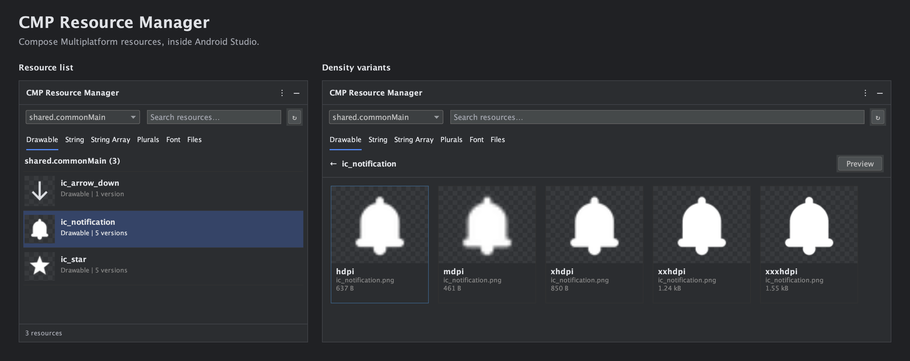

# CMP Resource Manager

Android Studio's built-in [Resource Manager](https://developer.android.com/studio/write/resource-manager) browses Android `res/` resources, but does not directly browse Compose Multiplatform `composeResources/` directories.

CMP Resource Manager adds resource browsing and previews for paths such as `shared/src/commonMain/composeResources/`, directly in Android Studio.

*Two browsing states shown side by side using the plugin’s Swing renderers and sample assets.*

## Features

- Browse Drawable, String, String Array, Plurals, Font, and Files across modules.
- Select a resource to compare its density and language variants.
- Preview images and Vector Drawable XML with transparency and original dimensions.
- Play and pause animated WebP without JCEF.
- Search resources and open their source files.
- Automatically refresh when the IDE detects saved changes.

## Install

Download the latest ZIP from [GitHub Releases](https://github.com/dev-weiqi/cmp-resource-manager/releases). In Android Studio, open **Settings → Plugins → gear icon → Install Plugin from Disk**, select the ZIP, and restart when prompted.

Then open **View → Tool Windows → CMP Resource Manager**.

Also listed on [JetBrains Marketplace](https://plugins.jetbrains.com/plugin/34699-cmp-resource-manager).

## Compatibility

Requires IntelliJ Platform build **261 or later** and the Android plugin bundled with Android Studio. Tested with **Android Studio 2026.1.4**.

Vector previews support standalone `<vector>` XML with literal dimensions and colors. Resource/theme references, selectors, and shape drawables are not rendered; use **Open source** to inspect them.

See [preview behavior and development](docs/reference.md) for supported formats, preview limits, and build instructions.

## License and support

[Apache License 2.0](LICENSE). Copyright 2026 WEIQI-WANG.

The icon is adapted from the Android Open Source Project’s Resource Manager icon. [Icon attribution and license](src/main/resources/META-INF/LICENSE-icons.txt).

[Report an issue](https://github.com/dev-weiqi/cmp-resource-manager/issues) · [Contact](mailto:dev.weiqi@gmail.com)
